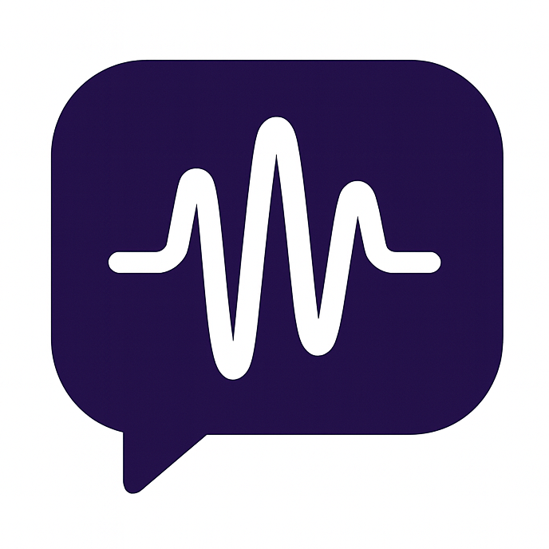

<h1>
     Vibe Remote
</h1>

[](https://www.python.org/)
[](#setup-guides)
[](LICENSE)
[](CONTRIBUTING.md)

[English](README.md) | [中文](README_ZH.md)


_Hands‑free remote vibe coding from Slack/Telegram._

Vibe Remote is a chat‑native controller for vibe coding. Trigger and steer coding CLIs (starting with Claude Code) from Slack/Telegram — minimal review, intent‑driven, ship faster. Built to work anywhere you work.

## Why Vibe Remote

- **Vibe coding, not micromanaging**: Let AI drive based on your intent and constraints; focus on outcomes.
- **Work from anywhere**: Control coding sessions over Slack/Telegram; no IDE tether.
- **Extensible by design**: Starts with Claude Code, built to support additional coding agents/CLIs.
- **Session persistence by thread + path**: Each Slack thread/Telegram chat maintains its own Claude session and working dir; auto‑resume via saved mappings.
- **Interactive Slack UX**: `/start` menu + Settings/CWD modals; buttons over commands for faster flow.

> Recommendation: Prefer Slack as the primary platform. Threaded conversations enable parallel subtasks and keep channel history tidy — each subtask stays in its own thread.

## Core Features

- **Multi‑platform**: First‑class Slack & Telegram support
- **Hands‑free flow**: Minimal review; messages stream back in real time
- **Persistent sessions**: Per chat/thread sessions, easy resume
- **Threaded Slack UX**: Clean, per‑conversation threads
- **Working dir control**: Inspect and change `cwd` on the fly
- **Personalization**: Toggle which message types to display

## Architecture (Brief)

- `BaseIMClient` + platform implementations (`slack.py`, `telegram.py`)
- `IMFactory` to construct clients by `IM_PLATFORM`
- `Controller` orchestrates sessions, formatting, and command routing

## Quick Start

1. Install dependencies

```bash
pip install -r requirements.txt
```

2. Create and edit `.env`

```bash
cp .env.example .env
# Set IM_PLATFORM and tokens
```

3. Run

```bash
./start.sh
# or
python main.py
```

## Configuration

### Platform selection

- `IM_PLATFORM=slack` or `IM_PLATFORM=telegram`

### Slack

- `SLACK_BOT_TOKEN` (xoxb-...)
- `SLACK_APP_TOKEN` (xapp-..., Socket Mode)
- `SLACK_TARGET_CHANNEL` optional whitelist of allowed channel IDs (channels only, start with `C`). Leave empty or omit to accept all channels. DMs are not supported currently.

### Telegram

- `TELEGRAM_BOT_TOKEN` from @BotFather
- `TELEGRAM_TARGET_CHAT_ID` optional whitelist: `[123,...]` | `[]` only DMs | `null` all

### Claude Code

- `CLAUDE_DEFAULT_CWD` e.g. `./_tmp`
- `CLAUDE_PERMISSION_MODE` e.g. `bypassPermissions`
- `CLAUDE_SYSTEM_PROMPT` optional
- `ANTHROPIC_API_KEY` if required by your SDK setup

### App

- `LOG_LEVEL` default `INFO`

## Usage

### Commands (all platforms)

- `/start` open menu / welcome
- `/clear` reset conversation/session
- `/cwd` show working directory
- `/set_cwd <path>` change working directory
- `/settings` configure message visibility
- `/stop` interrupt current execution

### Slack

- In channels, run `/start` to open the interactive menu (Current Dir, Change Work Dir, Reset Session, Settings, How it Works)
- The bot organizes each conversation as a thread; reply in the thread to continue
- Slack DMs are not supported currently
- Slash commands are limited in threads; to stop in a thread, type `stop` directly

### Telegram

- DM or group; run `/start` then type naturally
- Real‑time streaming; long outputs are split and code blocks are formatted

## Setup Guides

- Slack: [English](docs/SLACK_SETUP.md) | [中文](docs/SLACK_SETUP_ZH.md)
- Telegram: [English](docs/TELEGRAM_SETUP.md) | [中文](docs/TELEGRAM_SETUP_ZH.md)

## Roadmap

- Additional coding CLIs/agents beyond Claude Code
- More IM platforms (Discord, Teams)
- File upload/attachments piping to coding sessions
- Advanced session policies & permissions

## Contributing

See `CONTRIBUTING.md`. By participating you agree to `CODE_OF_CONDUCT.md`.

## License

MIT. See `LICENSE`.

## Security

## Security & Ops

- **Secrets**: Never commit tokens. Use `.env`. Rotate regularly.
- **Whitelists**: Restrict access via `SLACK_TARGET_CHANNEL` (channels only, `C…`) or `TELEGRAM_TARGET_CHAT_ID`. `null` accepts all; empty list limits to DMs/groups accordingly (Slack DMs currently unsupported).
- **Logs**: Runtime logs at `logs/claude_proxy.log`.
- **Session persistence**: `user_settings.json` stores per‑thread/chat session mappings and preferences; persist this file in production.
- **Cleanup**: Set `CLEANUP_ENABLED=true` to safely prune completed receiver tasks during message handling for long‑running processes.
