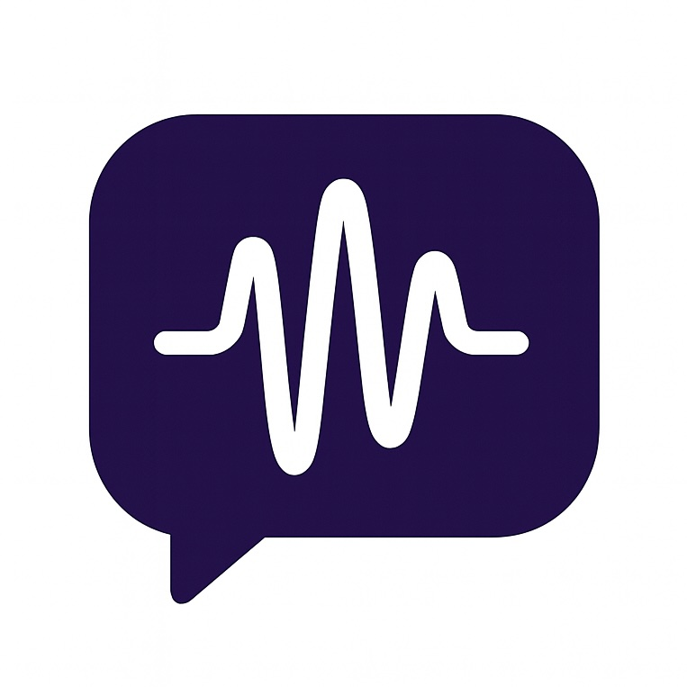

#  Vibe Remote

[](https://www.python.org/)
[](#setup-guides)
[](LICENSE)
[](CONTRIBUTING.md)

[English](README.md) | 中文


_面向 Slack/Telegram 的免干预 vibe coding 远程工作流。_

Vibe Remote 是一个面向聊天（chat‑native）的 vibe coding 控制器。你可以在 Slack/Telegram 中触发与引导编码 CLI（起步支持 Claude Code），以“意图驱动、最小 review”的方式更快交付。

## 为什么选择 Vibe Remote

- **专注 vibe coding**：基于你的意图与约束让 AI 自主推进，你只把控方向与结果。
- **随时随地**：不被 IDE 束缚，直接在 Slack/Telegram 中远程操控编码会话。
- **为扩展而生**：从 Claude Code 起步，后续可扩展到更多 coding agents/CLIs。
- **按线程 + 路径持久化**：每个 Slack 线程/Telegram 对话都维持独立 Claude 会话与工作目录，并通过持久化映射自动恢复。
- **Slack 交互式体验**：`/start` 菜单 + Settings/CWD 模态，按钮优先于命令，更快上手。

> 推荐：优先使用 Slack 作为主要平台。其线程模型更适合并行子任务，也能保持频道历史整洁（每个子任务都在各自的线程里）。

## 核心特性

- **多平台**：原生支持 Slack 与 Telegram
- **免干预工作流**：最小 review，实时流式回传消息
- **持久会话**：按聊天/线程维度持久化，可随时恢复
- **Slack 线程化 UX**：每个会话独立线程，保持频道整洁
- **工作目录控制**：随时查看与更改 `cwd`
- **个性化**：自定义隐藏的消息类型

## 架构（简述）

- `BaseIMClient` + 平台实现（`modules/im/slack.py`、`modules/im/telegram.py`）
- `IMFactory` 通过 `IM_PLATFORM` 动态创建客户端
- `Controller` 统一编排会话、格式化与命令路由

## 快速开始

1. 安装依赖

```bash
pip install -r requirements.txt
```

2. 创建并编辑 `.env`

```bash
cp .env.example .env
# 设置 IM_PLATFORM 与各自的 Token
```

3. 运行

```bash
./start.sh
# 或
python main.py
```

## 配置

### 平台选择

- `IM_PLATFORM=slack` 或 `IM_PLATFORM=telegram`

### Slack

- `SLACK_BOT_TOKEN`（xoxb-...）
- `SLACK_APP_TOKEN`（xapp-...，用于 Socket Mode）
- `SLACK_TARGET_CHANNEL` 可选的频道 ID 白名单（仅频道，形如 `C...`）。留空或省略为接受所有频道。当前不支持 Slack DM。

### Telegram

- `TELEGRAM_BOT_TOKEN` 来自 @BotFather
- `TELEGRAM_TARGET_CHAT_ID` 可选的聊天白名单：`[123,...]` | `[]` 仅私聊 | `null` 允许全部

### Claude Code

- `CLAUDE_DEFAULT_CWD` 例如 `./_tmp`
- `CLAUDE_PERMISSION_MODE` 例如 `bypassPermissions`
- `CLAUDE_SYSTEM_PROMPT` 可选
- `ANTHROPIC_API_KEY`（取决于你的 SDK 设置）

### 应用

- `LOG_LEVEL` 默认 `INFO`

## 使用方式

### Commands（全平台）

- `/start` 打开菜单/欢迎信息
- `/clear` 重置对话/会话
- `/cwd` 显示工作目录
- `/set_cwd <path>` 更改工作目录
- `/settings` 配置消息可见性
- `/stop` 中断当前执行

### Slack

- 在频道中运行 `/start` 打开交互菜单（Current Dir、Change Work Dir、Reset Session、Settings、How it Works）
- 机器人会把每次对话组织到各自的线程中；在线程中继续回复即可
- 当前不支持 Slack DM
- Slash 命令在线程中受限；要在线程内停止，请直接输入 `stop`

### Telegram

- 支持私聊/群组；先运行 `/start` 然后直接对话
- 支持实时流式输出；长消息自动分割；代码块自动格式化

## Setup Guides

- Slack： [English](docs/SLACK_SETUP.md) | [中文](docs/SLACK_SETUP_ZH.md)
- Telegram： [English](docs/TELEGRAM_SETUP.md) | [中文](docs/TELEGRAM_SETUP_ZH.md)

## Roadmap

- 扩展到更多编码 CLI/agents（超越 Claude Code）
- 更多 IM 平台（Discord、Teams）
- 文件上传/附件到编码会话的管道化
- 更细粒度的会话策略与权限

## Contributing

参见 `CONTRIBUTING.md`。参与即代表同意 `CODE_OF_CONDUCT.md`。

## License

MIT，详见 `LICENSE`。

## Security & Ops

- **Secrets**：不要提交 Token；使用 `.env`，并定期轮换。
- **Whitelists**：通过 `SLACK_TARGET_CHANNEL`（仅频道，`C…`）或 `TELEGRAM_TARGET_CHAT_ID` 限制访问。`null` 允许全部；空列表则只在相应上下文生效（Slack DM 当前不支持）。
- **Logs**：运行日志位于 `logs/claude_proxy.log`。
- **会话持久化**：`user_settings.json` 存储每个线程/聊天的会话映射与偏好；生产环境请持久化此文件。
- **清理**：设置 `CLEANUP_ENABLED=true`，在消息处理入口安全清理已完成的接收任务，适合长时间运行。
